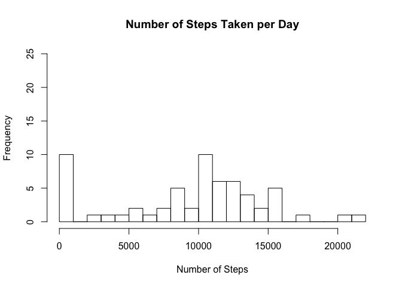
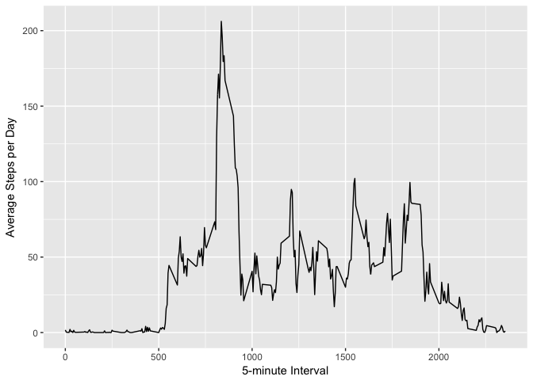
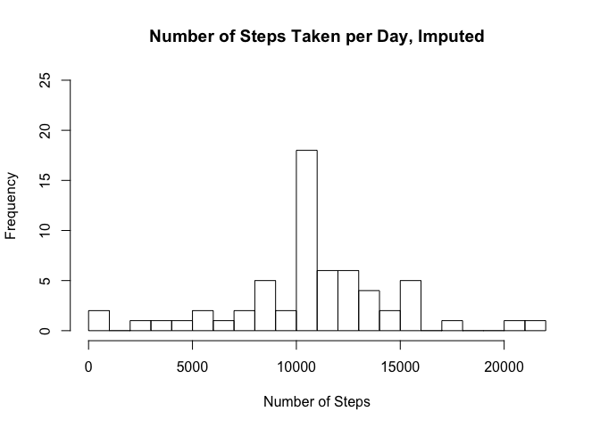
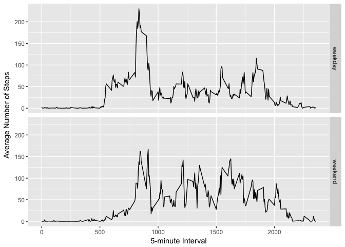

# Reproducible Research: Peer Assessment 1

## Loading and preprocessing the data

The assignment data 'activity.zip' was included in the forked github repository. The data was unzipped using R studio resulting in the file 'activity.csv'. A few librabries are required for the analysis.


```r
library(dplyr)
```

```
## 
## Attaching package: 'dplyr'
```

```
## The following objects are masked from 'package:stats':
## 
##     filter, lag
```

```
## The following objects are masked from 'package:base':
## 
##     intersect, setdiff, setequal, union
```

```r
library(ggplot2)
activity.df <- tbl_df(read.csv('activity.csv'))
```

Overview of the activity data table:


```r
activity.df <- arrange(activity.df,date,interval)
str(activity.df)
```

```
## Classes 'tbl_df', 'tbl' and 'data.frame':	17568 obs. of  3 variables:
##  $ steps   : int  NA NA NA NA NA NA NA NA NA NA ...
##  $ date    : Factor w/ 61 levels "2012-10-01","2012-10-02",..: 1 1 1 1 1 1 1 1 1 1 ...
##  $ interval: int  0 5 10 15 20 25 30 35 40 45 ...
```

Since the data is 'tidy', there isn't any preprocessing to be performed, aside from sorting.


## What is mean total number of steps taken per day?

Create a table of the number of steps (sum) taken each day. 

```r
steps.df <- activity.df %>% group_by(date) %>% summarise(steps.p.d = sum(steps, na.rm = TRUE)) 
```

A histogram of the number of steps taken per day:


```r
hist(steps.df$steps.p.d,
     main = "Number of Steps Taken per Day",
     xlab = "Number of Steps",
     breaks = 30,
     ylim=c(0,25))
```

<!-- -->

```r
avg.steps <- round(mean(steps.df$steps.p.d), digits = 0)
mid.steps <- median(steps.df$steps.p.d)
```

There were a **mean = 9354** and a **median = 10395** number of steps taken each day.


## What is the average daily activity pattern?

Below is a time series plot of the the average number of steps taken across all days (y-axis) per 5-minute daily interval (x-axis).


```r
interval.df <- activity.df %>% group_by(interval) %>% summarise(steps.p.i = mean(steps, na.rm = TRUE)) 
ci <- ggplot(interval.df,aes(x = interval,y = steps.p.i))
ci+geom_line()+
        labs( x = "5-minute Interval", y = "Average Steps per Day")
```

<!-- -->

Determine the interval with the greatest number of steps:


```r
max.i.df <- interval.df %>% slice(which.max(steps.p.i))
```

The 5-minute interval with the greatest number of average daily steps is **interval 835**, which matches the line chart above.


## Imputing missing values

The data appears 'tidy' but there are a number of $steps observations with 'NA'. What proportion of the dataset has these values?


```r
missing <- summarise(activity.df,sum(is.na(steps)))
```
1. There are **2304 missing values** in the dataset, out of a total of 17,568.

2. and 3. To account for the impact of the missing data, each of the missing step values will be replaced with the mean 5-minute interval value. This is accomplished by filtering the 'NA' data, joining with the existing 'interval.df' table from above, and binding rows to the non-'NA' table.


```r
activity.df.na <- filter(activity.df,is.na(steps)) 
activity.df.na <- right_join(activity.df.na,interval.df)
```

```
## Joining, by = "interval"
```

```r
activity.df.na <- select(activity.df.na, date, interval, steps.p.i) %>% rename(steps = steps.p.i)
activity.df.mut <- bind_rows(filter(activity.df,!is.na(steps)), activity.df.na) %>%
        arrange(date, interval)
str(activity.df.mut)
```

```
## Classes 'tbl_df', 'tbl' and 'data.frame':	17568 obs. of  3 variables:
##  $ steps   : num  1.717 0.3396 0.1321 0.1509 0.0755 ...
##  $ date    : Factor w/ 61 levels "2012-10-01","2012-10-02",..: 1 1 1 1 1 1 1 1 1 1 ...
##  $ interval: int  0 5 10 15 20 25 30 35 40 45 ...
```

4. New histogram of steps per day with the additional imputed step data included. 


```r
steps.df.mut <- activity.df.mut %>% group_by(date) %>%
        summarise(steps.p.d = sum(steps, na.rm = TRUE)) 
hist(steps.df.mut$steps.p.d,
     main = "Number of Steps Taken per Day, Imputed",
     xlab = "Number of Steps",
     breaks = 30,
     ylim=c(0,25))
```

<!-- -->

```r
avg.steps.mut <- round(mean(steps.df.mut$steps.p.d), digits = 0)
avg.per <- round(((avg.steps.mut-avg.steps)/avg.steps.mut)*100,digits = 0)
mid.steps.mut <- round(median(steps.df.mut$steps.p.d), digits = 0)
mid.per <- round(((mid.steps.mut-mid.steps)/mid.steps.mut)*100,digits = 0)
```

There were **mean = 1.0766\times 10^{4}** and **median = 1.0766\times 10^{4}** steps taken each day with the additional data. The inclusion of the additional values created a **difference** of:  
        a. 1412 mean steps (13 %).  
        b. 371 median steps (3 %).
        
This difference did not significantly alter the narrative of the data.


## Are there differences in activity patterns between weekdays and weekends?

Each of the days in the imputed activity dataset was assigned a "Weekday" or "Weekend" value depending where in the week the date fell.

```r
week.day <- c("Mon","Tue","Wed","Thu","Fri")
activity.df.mut.week <- mutate(activity.df.mut, 
        day = weekdays(as.Date(date), abbreviate = TRUE)) %>%
        mutate(week.days = if_else(day %in% week.day, "weekday","weekend"))
```

Creating the interval table:


```r
interval.df.week <- activity.df.mut.week %>% group_by(interval,week.days) %>% summarise(steps.p.i = mean(steps, na.rm = TRUE)) 
```

Plot the number of steps by interval and weekday below. There appears to be more walking on the weekends with a greater average number of steps during the middle of the day.


```r
ci <- ggplot(interval.df.week,aes(x = interval,y = steps.p.i))
ci + geom_line() +
        labs( x = "5-minute Interval", y = "Average Number of Steps") +
        facet_grid(week.days ~ .)
```

<!-- -->

